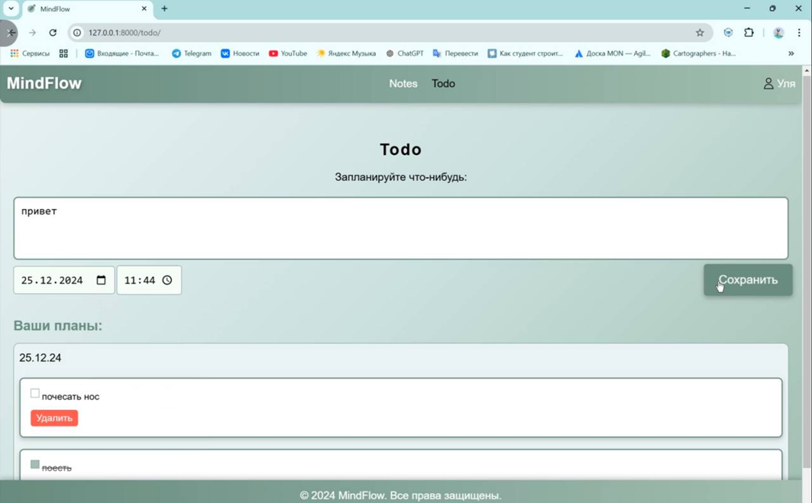
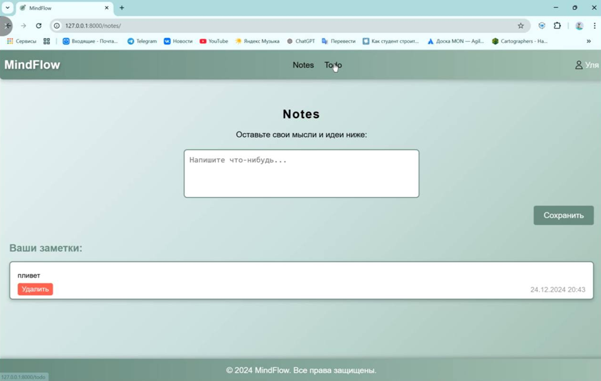

Чтобы запустить проект необходимо:
1. Скачать zip-архив из репозитория, разархивировать
2. Запустить скрипт базы данных script.sql в PostgreSQL
3. В командной строке перейти к папке mindflow/mindflow проекта 
4. Запустить команду python manage.py runserver
5. Перейти по ссылке, отображенной в командной строке

